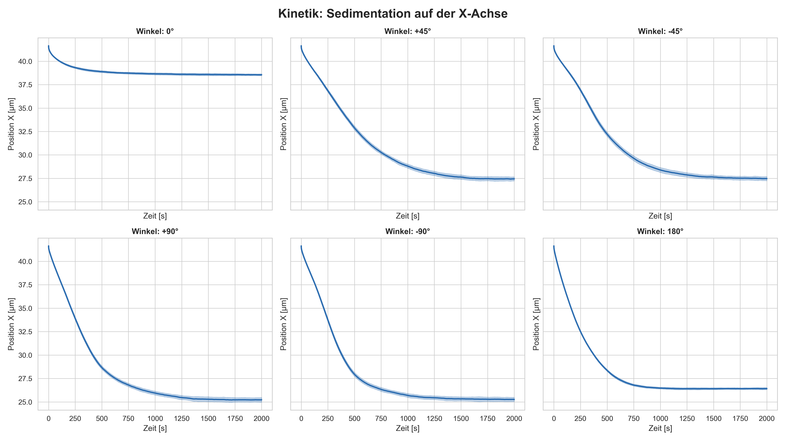
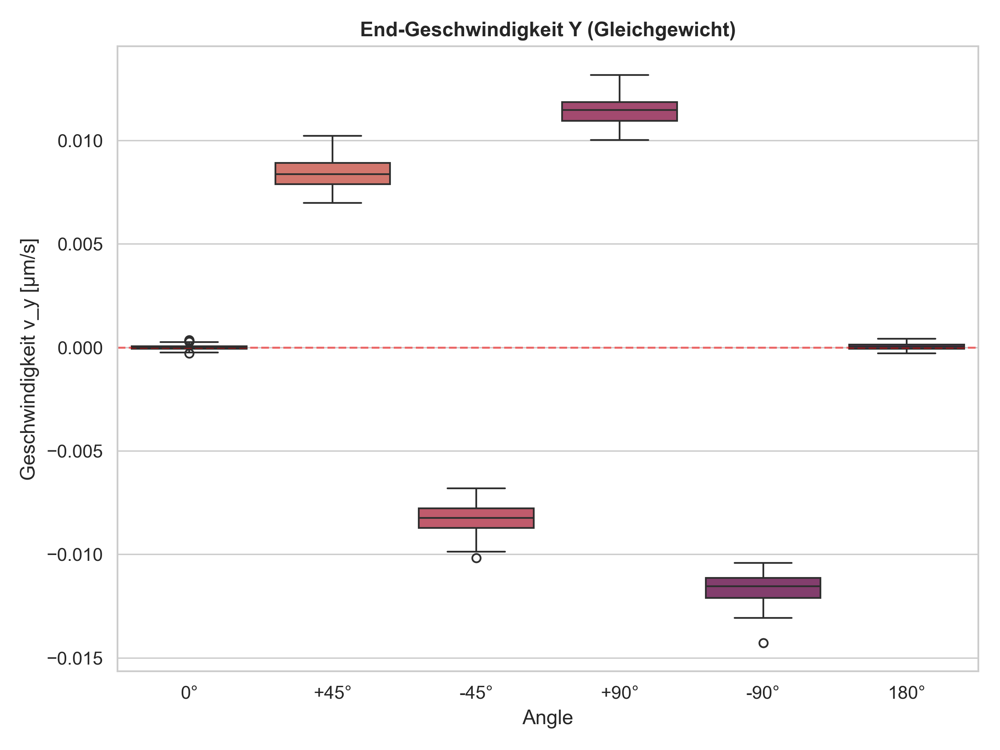
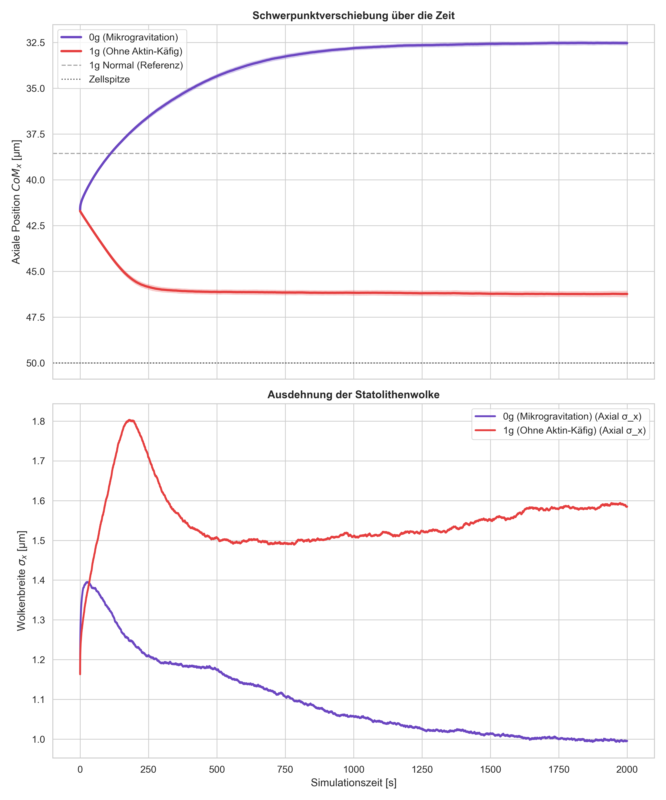

# In-Silico Statolith Simulation in Chara Rhizoids


> **Ein biophysikalischer Digital Twin zur Simulation der Graviperzeption in Pflanzenzellen.**


*(Hinweis: Diese Simulation modelliert die Dynamik von Statolithen (Schweresinnesorganellen) unter Einflüssen von Gravitation, Zytoplasma-Strömung und Aktin-Netzwerk.)*

---

## Abstract / Wissenschaftlicher Hintergrund

Gravitropismus beschreibt die Wachstumsbewegung von Pflanzen in Reaktion auf die Schwerkraft. Die Alge *Chara* dient als Modellorganismus, wobei speziell die Rhizoide zur Untersuchung der Graviperzeption genutzt werden. Die Wahrnehmung der Schwerkraft erfolgt über die Sedimentation von **Statolithen**. Diese bestehen aus vesikelumschlossenen BaSO4-Kristallen (Dichte $\approx 4.4\,\text{g/cm}^3$).

Die Statolithen sind in der subapikalen Zone innerhalb eines komplexen Aktin-Netzwerks aufgespannt. Zu jedem Zeitpunkt unterliegen sie einem dynamischen Kräftegleichgewicht:
1.  **Gravitation & Auftrieb** (Sedimentation nach dem Stokes'schen Gesetz)
2.  **Aktin-Kräfte** (Rückhaltekraft, modelliert als elastisches "Pufferkissen")
3.  **Inter-Partikel-Kräfte** (Kollisionen und Aggregation via Lennard-Jones-Potential)
4.  **Thermische Fluktuation** (Brownsche Bewegung)

Das vorliegende Programm ist ein **In-Silico Digital Twin** der Chara-Rhizoid-Zellspitze. Es dient der qualitativen und quantitativen Vorhersage der Statolithen-Verteilung und der Validierung biophysikalischer Hypothesen (z.B. zur Passivitäts-Baseline unter Mikrogravitation).

---

## Physikalisches Modell

### 1. Überdämpfte Langevin-Dynamik
Da sich die Statolithen in einem hochviskosen Medium (Zytoplasma, $\eta \approx 139\,\text{mPa}\cdot\text{s}$) bei extrem niedrigen Reynolds-Zahlen bewegen, dominiert die Reibung. Die Zeitintegration erfolgt über die **Euler-Maruyama-Methode**:

$$\vec{P}_{t+\Delta t} = \vec{P}_{t} + \underbrace{(\vec{F}_{grav} + \vec{F}_{actin} + \vec{F}_{LJ}) \cdot \mu \cdot \Delta t}_{\text{Deterministische Drift}} + \underbrace{\sqrt{2 D \Delta t} \cdot \mathcal{N}(0,1)}_{\text{Stochastische Diffusion}}$$

### 2. Aktin-Netzwerk (Mean-Field)
Das komplexe Aktin-Geflecht wird als kontinuierliches Kraftfeld angenähert. Ein exponentieller Term verhindert, dass die schweren Statolithen die sensitive Spitzenmembran ("Apex") beschädigen:

$$\vec{F}_{actin}(x) = -F_{max} \cdot \exp\left(-\frac{\Delta x}{\lambda}\right) \hat{e}_x$$

### 3. Partikel-Interaktion
Die Statolithen interagieren über ein modifiziertes **Lennard-Jones-Potential**. Die daraus resultierende Kraft $\vec{F}_{LJ}$, die die Abstoßung (Volumenausschluss) modelliert, berechnet sich zu:

$$F_{LJ}(r) = \frac{24 \epsilon}{r} \left[ 2 \left(\frac{\sigma}{r}\right)^{12} - \left(\frac{\sigma}{r}\right)^6 \right]$$

Zusätzlich sorgt ein **Velocity-Clipping**-Algorithmus für numerische Stabilität bei harten Kollisionen, indem er unrealistisch große Sprünge pro Zeitschritt unterbindet.

---

##  Key Results & Visualizations

Das Modell wurde durch umfangreiche Ensemble-Simulationen (N=100 Runs pro Bedingung, >16 Millionen Datenpunkte) statistisch rigoros kalibriert und validiert. Es liefert hochpräzise Vorhersagen für die passive Statolithen-Dynamik:

### 1. Sedimentations-Kinetik auf der Längsachse
Die Trajektorien des Schwerpunkts (Center of Mass, $CoM_x$) zeigen eine konsistente, viskos gedämpfte Kinetik. Die Statolithen fallen in Richtung der Zellspitze und werden durch die exponentielle Gegenkraft des apikalen Aktin-Netzwerks weich abgebremst, bis sie einen stabilen Ruhezustand erreichen.


### 2. Nachweis des mechanischen Gleichgewichts
Um zu beweisen, dass die Simulation einen echten, artefaktfreien physikalischen Ruhezustand erreicht, wird die Restgeschwindigkeit analysiert. Der Boxplot der lateralen Endgeschwindigkeit ($v_y$) beweist eine perfekte Konvergenz um den Nullpunkt. Deterministische Kräfte und die stochastische Brownsche Bewegung sind am Ende der Simulation vollständig ausbalanciert.


### 3. Mikrogravitation (0g) vs. Kontroll-Bedingungen (Die passive Baseline)
Dieses Panel vergleicht das System unter simulierter Schwerelosigkeit (0g) mit einer Kontrollbedingung (1g ohne Aktin-Käfig). 
* **Oben (Schwerpunkt-Verschiebung):** Die axiale Verschiebung des Schwerpunkts über die Zeit. Bei 0g wird die Wolke rein passiv durch das Aktin in eine Gleichgewichtsposition im Käfig gedrückt.
* **Unten (Wolkenausdehnung):** Die Dynamik der Wolkenbreite ($\sigma_x$). Unter 0g komprimiert das elastische Netzwerk die Wolke massiv auf eine minimale Basisbreite. 

*Wissenschaftliche Relevanz:* Diese rein passive Dynamik liefert die erste in-silico Referenz-Baseline (Nullhypothese). Jede Abweichung von diesen vorhergesagten Werten in echten Raumfahrt-Experimenten quantifiziert exakt den Effekt der biologischen Asymmetrie und des aktiven Aktomyosin-Transports.


---

## Software-Architektur

Das Projekt folgt strikt dem **Model-View-Controller (MVC)** Pattern, um wissenschaftliche Logik von der Darstellung zu trennen:

* **`simulation/` (Model):**
    * `engine.py`: Enthält den Physik-Kern (Integrator).
    * `warmup.py`: Generiert stabile Anfangszustände durch Vor-Simulation (Sedimentierung).
* **`physics/` (Logic):**
    * Modulare Berechnung der Kräfte (`forces.py`), Brownschen Bewegung (`brownian_motion.py`) und geometrischen Constraints (`constraints.py`).
* **`visualization/` (View):**
    * Nutzung von **PyVista** (VTK-Wrapper) für performantes 3D-Rendering in Echtzeit.
* **`config/` (Data):**
    * Zentrale Verwaltung aller physikalischen Parameter ($g$, $\eta$, $k_B$) in SI-konformen, mikrometer-skalierten Einheiten.

---

## Installation & Nutzung

### Voraussetzungen
* Python 3.8 oder höher
* Empfohlen: Eine virtuelle Umgebung (venv)

### Schritt-für-Schritt

1.  **Repository klonen**
    ```bash
    git clone [https://github.com/Faneez511/chara-statolith-sim.git](https://github.com/Faneez511/chara-statolith-sim.git)
    cd chara-statolith-sim
    ```

2.  **Virtuelle Umgebung erstellen (Optional, aber empfohlen)**
    ```bash
    python -m venv venv
    # Windows:
    .\venv\Scripts\activate
    # Mac/Linux:
    source venv/bin/activate
    ```

3.  **Abhängigkeiten installieren**
    Das Projekt nutzt `pyvista`, `numpy`, `pandas`, `seaborn` und `matplotlib`.
    ```bash
    pip install -r requirements.txt
    ```

4.  **Simulation starten**
    ```bash
    python main.py
    ```

### Steuerung
* Ein Dialog fragt zu Beginn nach dem Zelldurchmesser (Standard: 15 µm).
* **3D-Navigation:** Linke Maustaste (Drehen), Rechte Maustaste (Zoom), Shift+Klick (Verschieben).
* **Tastatur:**
    * `R`: Simulation zurücksetzen (Reset).
    * `Q`: Beenden.

---

## Roadmap / Nächste Schritte

* [x] Implementierung der Langevin-Dynamik & Kollisionen
* [x] Visualisierung des Zell-Käfigs (PyVista)
* [x] Numerische Stabilisierung (Velocity Clipping)
* [x] Data-Logger: Export der Schwerpunkt-Koordinaten (CoM) als CSV
* [x] Rigoroses Batch-Testing (N=100) & Statistik-Pipeline (`master_analysis.py`)
* [x] **Validierung gegen Primärliteratur (Braun, Limbach, Hauslage)**
* [ ] Erweiterung des Modells um aktive Myosin-Transport-Vektoren

---

**Autor:** Faneez Shah Polat  
*Biotechnologie, 2. Semester, HAW-Hamburg*
